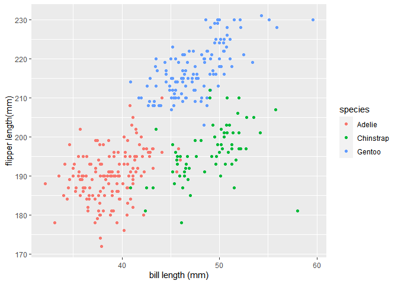

p8105_hw1_sl5232
================
Shangsi Lin
2022-09-23

# Problem 1

## Load data and tidyverse

``` r
library(tidyverse)
```

    ## ── Attaching packages ─────────────────────────────────────── tidyverse 1.3.2 ──
    ## ✔ ggplot2 3.3.6      ✔ purrr   0.3.4 
    ## ✔ tibble  3.1.8      ✔ dplyr   1.0.10
    ## ✔ tidyr   1.2.0      ✔ stringr 1.4.1 
    ## ✔ readr   2.1.2      ✔ forcats 0.5.2 
    ## ── Conflicts ────────────────────────────────────────── tidyverse_conflicts() ──
    ## ✖ dplyr::filter() masks stats::filter()
    ## ✖ dplyr::lag()    masks stats::lag()

``` r
data("penguins", package = "palmerpenguins")
```

## Short description of the penguin dataset

The penguins dataset includes information about species, island,
bill_length_mm, bill_depth_mm, flipper_length_mm, body_mass_g, sex, year
of the individuals of interest.

The row size of the penguins dataset is 344 and the column size of the
dataset is 8.

The mean flipper length of the penguins dataset is 200.9152047

## Making and saving a scatterplot of flipper length(y) vs. bill length(x), different colors represent different species.

``` r
flipper_vs_bill_scatterplot_df =
  tibble(
    x = penguins$bill_length_mm,
    y = penguins$flipper_length_mm,
    species = penguins$species
  )

flipper_vs_bill_scatterplot = ggplot(flipper_vs_bill_scatterplot_df, aes(x,  y, color = species)) + geom_point()
print(flipper_vs_bill_scatterplot + labs(y = "flipper length(mm)", x = "bill length (mm)"))
```

    ## Warning: Removed 2 rows containing missing values (geom_point).

<!-- -->

``` r
ggsave("flipper_vs_bill_scatterplot.pdf")
```

    ## Saving 7 x 5 in image

    ## Warning: Removed 2 rows containing missing values (geom_point).
